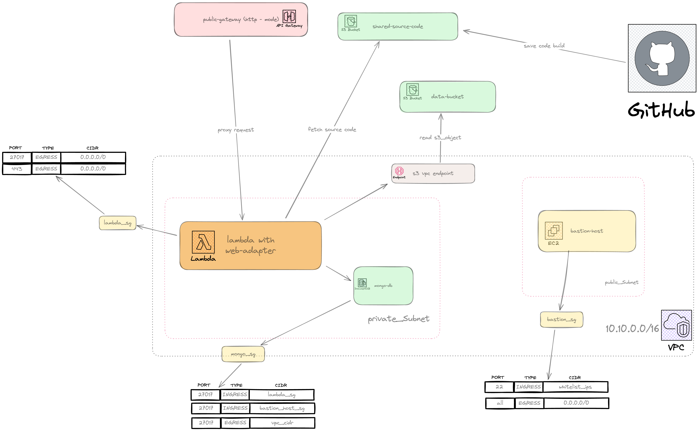

# nestjs-lambda

## summary

- cloud: AWS
- running a nestjs application under the lambda function
- service can read/write to S3
- service connect to MongoDB
- using AWS DocumentDB to run MongoDB

## architecture



## prerequisites

- aws
- terraform
- nodejs

##

- set up base infra

example default.tfvars

```tf
aws_profile     = "nestjs_lambda"
aws_region      = "ap-southeast-2"
aws_accountnum  = "124883510775"
vpc_cidr        = "10.10.0.0/16"
private_subnets = ["10.10.1.0/24", "10.10.2.0/24", "10.10.3.0/24"]
public_subnets  = ["10.10.101.0/24", "10.10.102.0/24", "10.10.103.0/24"]
```

```bash
cd infra/base
terraform init
terraform plan -var-file=default.tfvars
terraform apply -var-file=default.tfvars
```

- publish lambda artifact to s3

```
./scripts/build.sh
```

- set up lambda

```bash
cd infra/nestjs-lambda
terraform init
terraform plan -var-file=default.tfvars
terraform apply -var-file=default.tfvars
```
